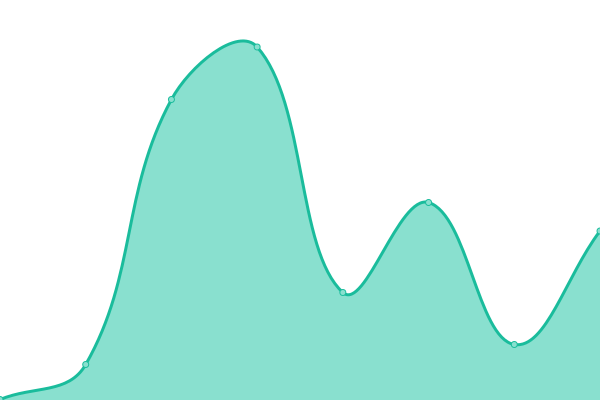
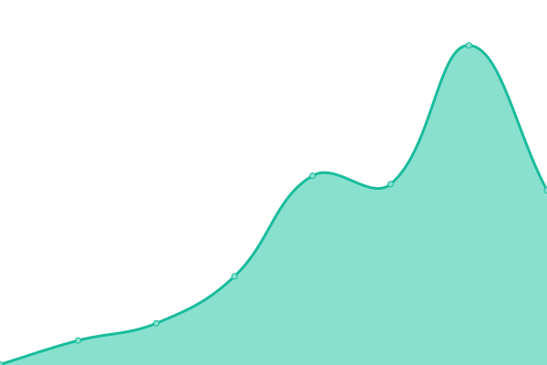
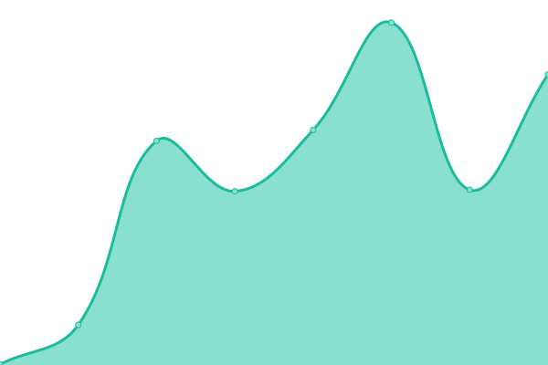
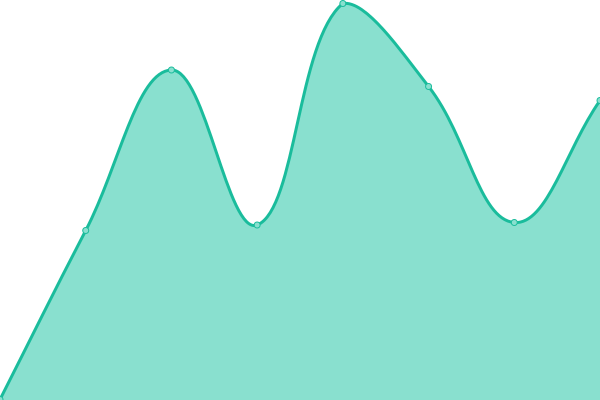
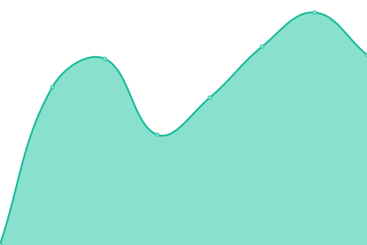

# [📈 Live Status](https://status.toca.social): <!--live status--> **🟩 All systems operational**

This repository contains the open-source uptime monitor and status page for [TOCA Social](https://status.toca.social), powered by [Upptime](https://github.com/upptime/upptime).

With [Upptime](https://upptime.js.org), you can get your own unlimited and free uptime monitor and status page, powered entirely by a GitHub repository. We use [Issues](https://github.com/toca-football/uptime/issues) as incident reports, [Actions](https://github.com/toca-football/uptime/actions) as uptime monitors, and [Pages](https://status.toca.social) for the status page.

<!--start: status pages-->
<!-- This summary is generated by Upptime (https://github.com/upptime/upptime) -->
<!-- Do not edit this manually, your changes will be overwritten -->
<!-- prettier-ignore -->
| URL | Status | History | Response Time | Uptime |
| --- | ------ | ------- | ------------- | ------ |
|  [Website](https://www.toca.social) | 🟩 Up | [website.yml](https://github.com/toca-football/uptime/commits/HEAD/history/website.yml) | 

 598ms
     
 | 

<a href="https://status.toca.social/history/website">100.00%</a>
    

|  [Reception](https://horae.toca.social) | 🟩 Up | [reception.yml](https://github.com/toca-football/uptime/commits/HEAD/history/reception.yml) | 

 288ms
     
 | 

<a href="https://status.toca.social/history/reception">100.00%</a>
    

|  [Kiosk](https://kiosk.toca.social) | 🟩 Up | [kiosk.yml](https://github.com/toca-football/uptime/commits/HEAD/history/kiosk.yml) | 

 334ms
     
 | 

<a href="https://status.toca.social/history/kiosk">100.00%</a>
    

|  [Photobooth](https://photobooth.toca.social) | 🟩 Up | [photobooth.yml](https://github.com/toca-football/uptime/commits/HEAD/history/photobooth.yml) | 

 234ms
     
 | 

<a href="https://status.toca.social/history/photobooth">100.00%</a>
    

|  [Bookings API](https://booking.api.toca.social/ping) | 🟩 Up | [bookings-api.yml](https://github.com/toca-football/uptime/commits/HEAD/history/bookings-api.yml) | 

 494ms
     
 | 

<a href="https://status.toca.social/history/bookings-api">100.00%</a>
    

|  [Contact API](https://contact.api.toca.social/ping) | 🟩 Up | [contact-api.yml](https://github.com/toca-football/uptime/commits/HEAD/history/contact-api.yml) | 

 557ms
     
 | 

<a href="https://status.toca.social/history/contact-api">100.00%</a>
    

|  [Payment API](https://payment.api.toca.social/ping) | 🟩 Up | [payment-api.yml](https://github.com/toca-football/uptime/commits/HEAD/history/payment-api.yml) | 

 594ms
     
 | 

<a href="https://status.toca.social/history/payment-api">100.00%</a>
    

|  [Session API](https://session.api.toca.social/ping) | 🟩 Up | [session-api.yml](https://github.com/toca-football/uptime/commits/HEAD/history/session-api.yml) | 

 503ms
     
 | 

<a href="https://status.toca.social/history/session-api">100.00%</a>
    

<!--end: status pages-->

[**Visit our status website →**](https://status.toca.social)

## 📄 License

- Powered by: [Upptime](https://github.com/upptime/upptime)
- Code: [MIT](./LICENSE) © [TOCA Social](https://status.toca.social)
- Data in the `./history` directory: [Open Database License](https://opendatacommons.org/licenses/odbl/1-0/)
